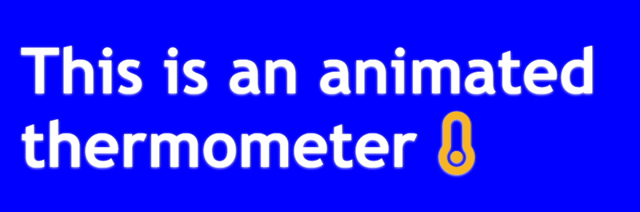

# animated-thermometer
 A dynamic animated thermometer built with HTML, CSS, and JavaScript that visually fills up, changes color at full level, and loops infinitely.

# 🌡️ Animated Thermometer

An animated thermometer built using HTML, CSS, and JavaScript. The thermometer fills up smoothly, changes its color to red when it reaches the full level, and then resets in a continuous loop. A visually appealing project that showcases dynamic DOM manipulation and CSS transitions.

## 🚀 Features

- 🔄 Looping fill animation
- 🌈 Color transition (turns red at full level)
- 💡 Clean and simple UI
- 🧠 Beginner-friendly code
- 📱 Responsive design

## 🛠️ Tech Stack

- **HTML5** – Structure
- **CSS3** – Styling and animations
- **JavaScript** – Dynamic behavior and timing

## 📸 Preview

  


## 📂 How to Run

1. **Clone the repository:**
   ```bash
   git clone https://github.com/yashsri2802/animated-thermometer.git

2. **Open the project:**
- Navigate into the project folder
- Open index.html in your browser

No build tools or dependencies required – it runs as a simple static site.

## 💡 Inspiration
This project was built to creatively explore how animations and visual feedback can be implemented using just HTML, CSS, and JavaScript. It's a fun way to practice intervals, DOM updates, and transitions.

## 🤝 Contributing
Contributions, issues, and suggestions are welcome!

## 📄 License
This project is licensed under the MIT License.
You are free to use, modify, and distribute this software with attribution.
